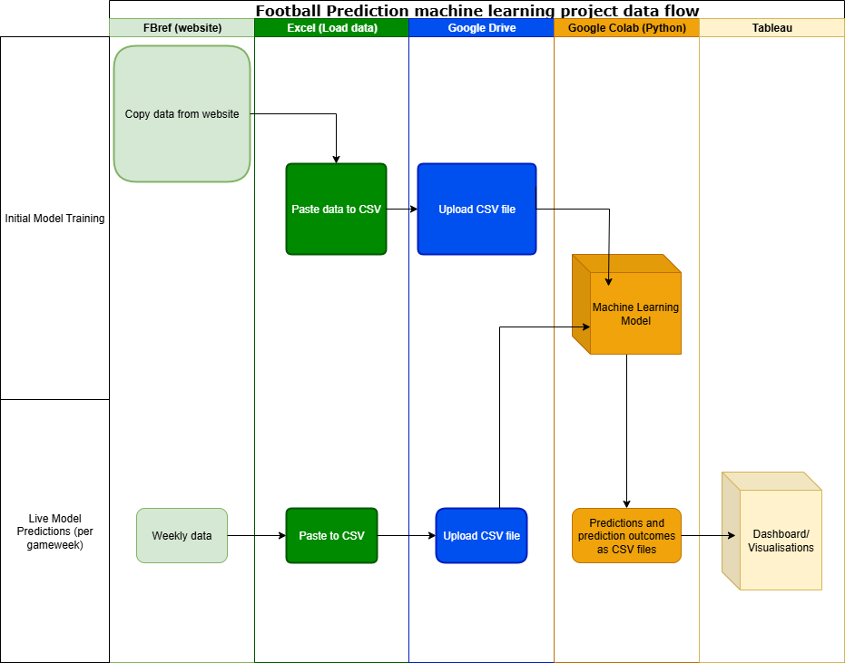
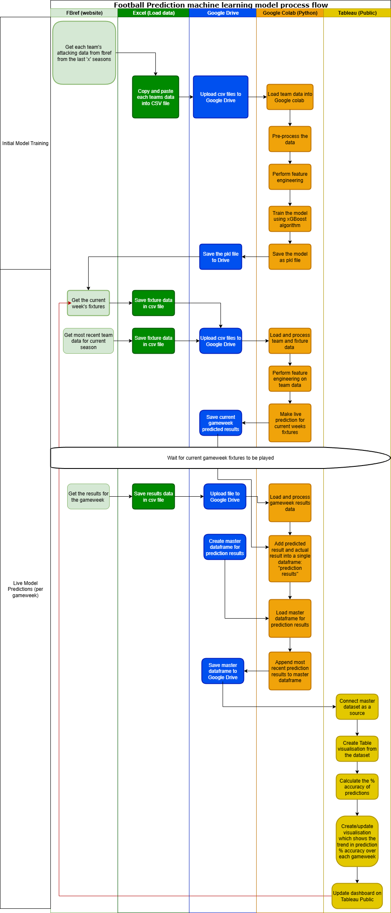

# andreas-football-predictor-project
A repository with all the files and documentation from my self challenged machine learning project where I created a model which predicts the outcomes of Premier League football matches.

# Project Purpose
The main purpose of this project was to create and train a machine learning model which predicts the outcome of Premier League football matches, which can then be used to make live predictions during the current Premier League season.
Then, the outcomes of these live predictions can be displayed in a dashboard in order to show how many correct predictions the model makes each week, and show the trend of its prediction accuracy over the course of the season, to see if the model needs to be retrained.

# Link to Tableau Public dashboard
https://public.tableau.com/app/profile/andreas.wong/viz/PremierLeagueMatchPredictions/PremierLeagueMatchPredictorDashboard?publish=yes

# Elements
Files called '20xx-20xx Fixtures' contain the Premier League fixtures for each season, per gameweek. These are used in the Live Predictor.
Files called '20xx-20xx Results' contain the results of each Premier League fixture per gameweek. These are used in the Live Predictor
'Documentation' contains the Data Flow Diagram and Process Flow Diagram which are displayed below in the README file.
'Encode Tables' contains each Premier League team (across all seasons) and their corresponding numerical value, created via encoding when training the machine learning model.

# Data Flow Diagram

# Detailed Process Flow Diagram

