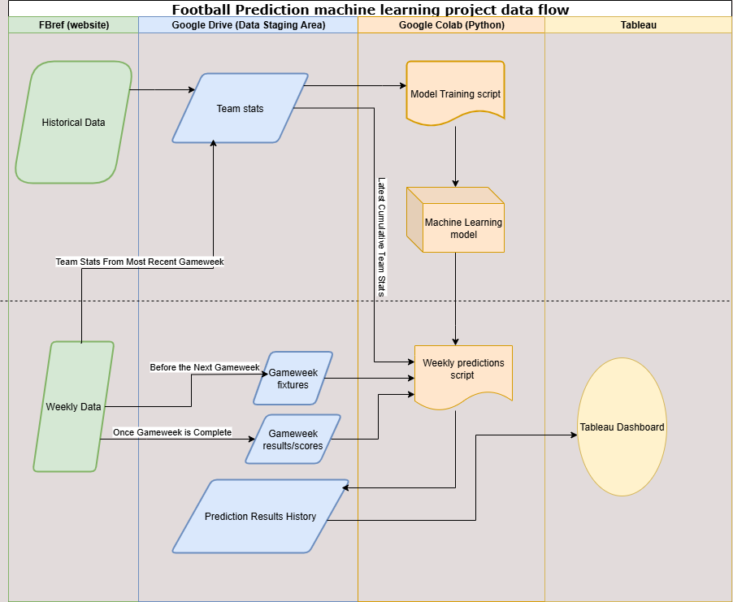
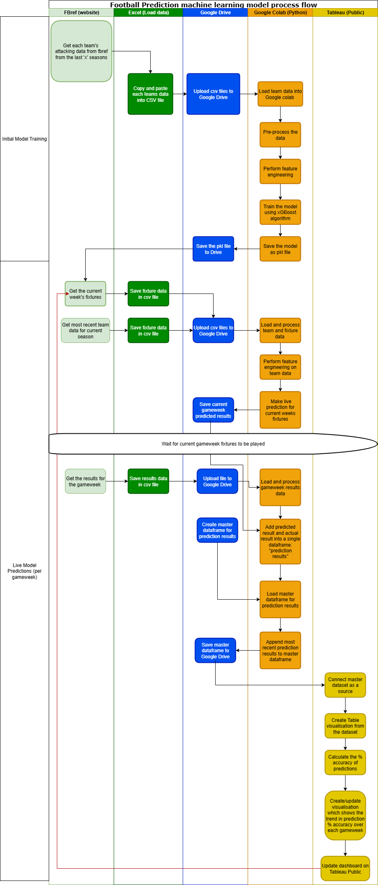

# andreas-football-predictor-project
A repository with all the files and documentation from my self challenged machine learning project where I created a model which predicts the outcomes of Premier League football matches.

# Project Purpose
The main purpose of this project was to create and train a machine learning model which predicts the outcome of Premier League football matches, which can then be used to make live predictions during the current Premier League season.
Then, the outcomes of these live predictions can be displayed in a dashboard in order to show how many correct predictions the model makes each week, and show the trend of its prediction accuracy over the course of the season. The aim is to keep the average accuracy above 55% (>20% higher than a random guess), by retraining the model when the average accuracy falls close to this value.

# Link to Tableau Public dashboard
https://public.tableau.com/app/profile/andreas.wong/viz/PremierLeagueMatchPredictions/PremierLeagueMatchPredictorDashboard?publish=yes

# Data Flow Diagram

# Detailed Process Flow Diagram

# Components
**Code** contains the python code for the model training notebook and the live predictor

**Documentation** contains the flow chart and data flow diagram associated with this project

**Data** contains all the data used to train the model and to make live predictions, as well as all the predictions and prediction results

